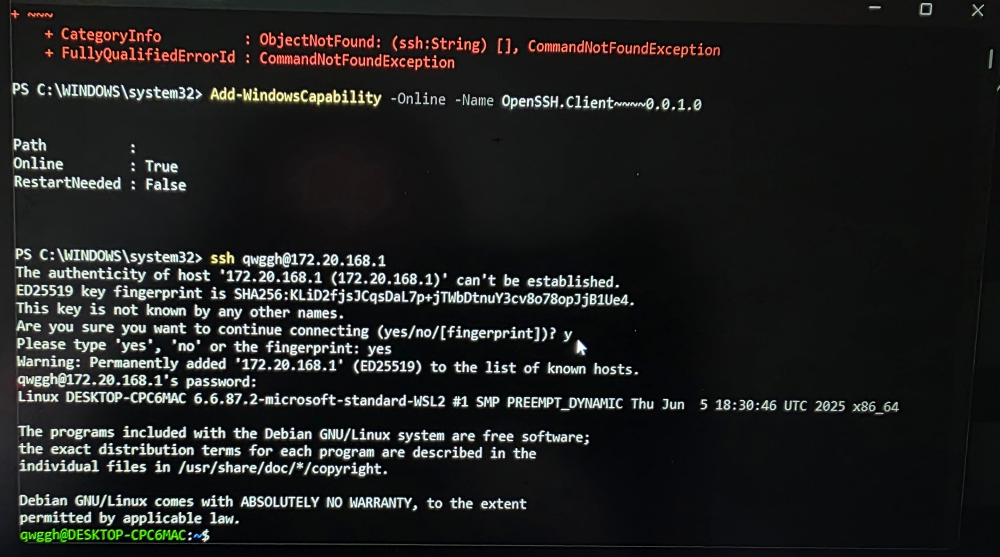
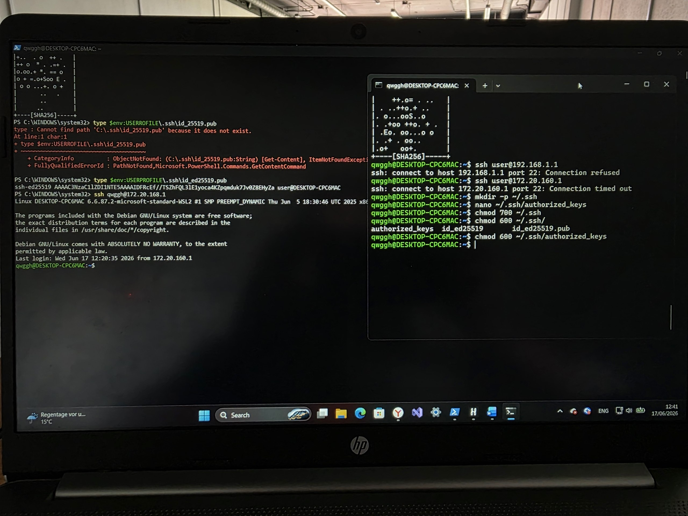

# SSH Lab

This repository contains my practice of configuring SSH access to a Debian WSL2 environment from Windows using OpenSSH.

## Tech Stack

- Windows 11
- WSL2
- Debian
- OpenSSH
- PowerShell

## What I did

- Configured SSH access to Debian WSL.
- Connected from Windows PowerShell.
- Generated SSH keys.
- Set up key-based authentication.

## Repository

```text
ssh-lab/
├── README.md
└── screenshots/
    ├── connecting.jpg
    └── ssh-keys.jpg
```

## Screenshots

### SSH connection



### SSH key authentication


